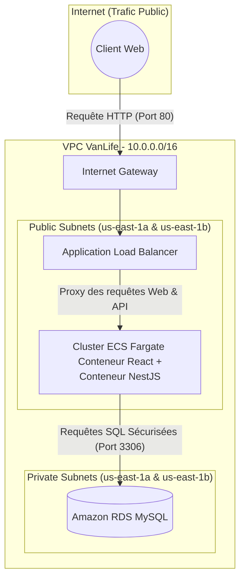

# Rapport d’Implémentation : Conception et Déploiement Infonuagique (VanLife)

> [!NOTE]
> **Cours** : 420-414-H26 Infonuagique  
> **Prénom & Nom** : Haroune Belhachani  
> **Matricule** : 2471001  
> **Option Choisie** : Option B – Déploiement sur Amazon ECS et RDS  

---

## 1. Introduction

Ce rapport détaille la stratégie complète de modernisation, de conteneurisation et de déploiement cloud de l'application **VanLife**, une plateforme de location de vans aménagés. Face aux défis de mise en production, l'application originellement composée d'un frontend React et d'une API NestJS a été entièrement transformée en une architecture **Cloud-Native**.

L'infrastructure déployée sur AWS est conçue pour être hautement disponible, sécurisée et "serverless" grâce à l'utilisation conjointe d'**Amazon ECS (Fargate)** et d'**Amazon RDS**. De plus, l'ensemble du cycle de déploiement a été entièrement automatisé via le concept d'Infrastructure-as-Code (IaC) avec **Terraform**, garantissant une reproductibilité sans faille.

---

## 2. Références des Dépôts et Artefacts

Pour garantir une séparation claire des préoccupations (*Separation of Concerns*), le projet est organisé autour d'un dépôt parent et de sous-modules Git (Submodules) pointant vers des dépôts isolés et spécialisés.

| Composant | Lien vers le Dépôt GitHub | Rôle et Description |
| :--- | :--- | :--- |
| **Dépôt Parent** | [Haroune07/epreuve-finale-h26](https://github.com/Haroune07/epreuve-finale-h26) | Contient les références Submodules vers les autres dépôts et le fichier `README.md` principal. |
| **Infrastructure (IaC)** | [Haroune07/414-vanlife-infrastructure](https://github.com/Haroune07/414-vanlife-infrastructure) | Contient le code source Terraform gérant toute l'infrastructure AWS (Réseau, Sécurité, ECS, RDS). |
| **Frontend (React)** | [Haroune07/414-vanlife-frontend](https://github.com/Haroune07/414-vanlife-frontend) | Code source du Frontend React et fichier `Dockerfile`. |
| **API Backend (NestJS)** | [Haroune07/414-vanlife-api](https://github.com/Haroune07/414-vanlife-api) | Code source de l'API Node.js/NestJS et fichier `Dockerfile`. |

> [!TIP]
> **Artefacts Docker Hub** : Les images Docker finales ont été compilées et poussées publiquement sur le Docker Hub.  
> 🌍 **Frontend** : [`hub.docker.com/r/haroune07/vanlife-frontend`](https://hub.docker.com/r/haroune07/vanlife-frontend)  
> 🌍 **API** : [`hub.docker.com/r/haroune07/vanlife-api`](https://hub.docker.com/r/haroune07/vanlife-api)

---

## 3. Architecture Globale

Le système repose sur une architecture robuste déployée sur AWS (Région `us-east-1`). J'ai opté pour l'**Option B**, tout en ajoutant un **Application Load Balancer (ALB)** et des **Sous-réseaux Privés** pour respecter les véritables standards de l'industrie.



**Flux des données** :
1. L'utilisateur interroge l'URL publique de l'Application Load Balancer.
2. L'ALB route le trafic entrant vers le service ECS hébergé dans le réseau public.
3. Le conteneur Nginx intercepte le trafic. Si c'est une requête API (`/api/*`), Nginx effectue un *reverse proxy* interne (`localhost:3000`) vers le conteneur NestJS au sein de la même tâche.
4. L'API NestJS traite la logique d'affaires en effectuant des requêtes sur la base de données RDS située de manière invisible et inaccessible dans le réseau privé.

---

## 4. Conteneurisation (Docker)

La conteneurisation a été réalisée en respectant les meilleures pratiques de sécurité et d'optimisation via la technique du **Build Multi-Stage**. Cela garantit que le code source, les dépendances inutiles et les vulnérabilités liées aux outils de compilation ne se retrouvent pas en production.

### A. Frontend (React + Nginx)
*   **Stage 1 (Builder)** : Utilisation de l'image `node:20-alpine` pour installer les dépendances et exécuter la compilation (`npm run build`). Seul le dossier `/dist` statique est conservé.
*   **Stage 2 (Production)** : Utilisation d'une image `nginx:alpine` très légère. 
*   **Reverse Proxy Nginx** : C'est le point technique clé. Le fichier `nginx.conf` a été méticuleusement configuré pour servir les fichiers statiques de React à la racine (`/`), et intercepter toute route commençant par `/api/` afin de rediriger ce trafic vers `http://localhost:3000` (le conteneur API).

### B. API (NestJS)
*   **Stage 1 (Builder)** : Installation complète avec `npm install` et transpilation du TypeScript en JavaScript optimisé.
*   **Stage 2 (Production)** : Nettoyage du cache, installation stricte des modules nécessaires (`npm install --only=production`), allégeant considérablement l'image finale.

> [!IMPORTANT]
> L'utilisation rigoureuse de fichiers `.dockerignore` prévient la copie du lourd répertoire `node_modules` local, accélérant drastiquement le temps de *build* et réduisant la surface d'attaque.

---

## 5. Infrastructure Réseau (VPC & Subnets)

L'architecture réseau est la fondation de la sécurité applicative. Un nouveau *Virtual Private Cloud* (VPC) a été instancié (`10.0.0.0/16`) et segmenté en profondeur :

1.  **Internet Gateway (IGW)** : Attachée au VPC, elle sert de porte de sortie et d'entrée pour le trafic public.
2.  **Sous-réseaux Publics (`10.0.0.0/24`, `10.0.1.0/24`)** : Déployés sur deux Zones de Disponibilité (AZ) différentes. Ils hébergent l'ALB et les Tâches ECS, ayant des IPs publiques et une table de routage pointant vers l'IGW.
3.  **Sous-réseaux Privés (`10.0.2.0/24`, `10.0.3.0/24`)** : **Innovation de sécurité**. Ces sous-réseaux n'ont **aucune** route vers l'Internet externe (`publicly_accessible = false`). Ils abritent la base de données RDS, la rendant techniquement introuvable par le monde extérieur, même en connaissant son IP.

---

## 6. Ressource de Calcul et Orchestration (Amazon ECS Fargate)

Le calcul s'appuie sur le service **Amazon ECS** et le modèle de lancement **AWS Fargate** (*Serverless*). 

**Pourquoi ECS Fargate ?**
Ce choix technologique permet de faire abstraction des serveurs physiques. Il n'y a aucune instance EC2 à maintenir, patcher ou redémarrer.

### Conception Stratégique de la Tâche ECS :
Le coup de génie architectural réside dans la configuration de la *Task Definition*. J'ai placé **les deux conteneurs (Frontend Nginx et API NestJS)** à l'intérieur d'une seule et unique Tâche.

*   **Mode Réseau (`awsvpc`)** : En mode `awsvpc`, tous les conteneurs d'une même tâche partagent la même ENI (Interface Réseau Élastique).
*   **Communication Inter-Conteneurs** : Grâce à ce partage, le Frontend et le Backend communiquent via `localhost`. Ainsi, Nginx transfère les requêtes à `http://localhost:3000` de façon totalement sécurisée et transparente en contournant les problèmes de CORS habituels. L'API (port 3000) n'a même pas besoin d'être exposée à l'extérieur.

---

## 7. Intégration de la Base de Données (Amazon RDS)

L'API NestJS nécessite une persistance de données robuste. La base MySQL 8.0 (`db.t3.micro`) est hébergée sur **Amazon RDS** afin de décharger l'équipe de développement des sauvegardes, mises à jour mineures et correctifs de sécurité gérés automatiquement par AWS.

**La gestion des variables d'environnement (Connexion)** :
Plutôt que de coder en dur (*hardcoder*) l'adresse de la base de données, la configuration ECS injecte de manière dynamique l'Endpoint généré par AWS lors de l'instanciation de la ressource RDS.
```hcl
environment = [
  { name = "DB_HOST", value = aws_db_instance.mysql.address },
  { name = "DB_USER", value = "admin" },
  { name = "DB_PASSWORD", value = local.db_password },
  { name = "DB_NAME", value = "vanlife" }
]
```

---

## 8. Stratégie de Sécurité

La sécurité n'est pas une réflexion après coup, mais intégrée "by design" via une approche en **entonnoir (Cascade d'accès)** et selon le principe du moindre privilège :

| Niveau du Security Group | Règles d'accès entrantes (Ingress) | Logique d'affaires |
| :--- | :--- | :--- |
| **1. SG ALB (Répartiteur)** | Port 80 autorisé depuis `0.0.0.0/0`. | L'ALB est la seule ressource publiquement accessible de l'architecture. |
| **2. SG ECS (Application)** | Autorise le Port 80 **UNIQUEMENT** si le trafic provient du *SG ALB*. | Bloque l'Internet direct. Les requêtes illégitimes tentant d'interroger directement l'IP d'ECS sont rejetées silencieusement. |
| **3. SG RDS (Base de Données)** | Autorise le Port 3306 **UNIQUEMENT** si le trafic provient du *SG ECS*. | Protège l'intégrité des données à 100%. Aucune autre machine, ni même l'administrateur depuis chez lui, ne peut y accéder. |

De plus, les tâches s'exécutent avec le rôle IAM minimal requis (`LabRole`).

---

## 9. Haute Disponibilité et Résilience

L'application est conçue pour ne subir aucune interruption :

*   **Redondance Multi-AZ** : Le VPC étend ses sous-réseaux sur deux Zones de Disponibilité physiques (`us-east-1a` et `us-east-1b`). En cas d'incendie ou de panne d'un *Data Center* Amazon, la ressource peut être relancée dans l'autre zone.
*   **Auto-Guérison (Self-Healing)** : L'orchestrateur ECS est paramétré avec un `desired_count = 1`. Si un bug critique fait crasher le conteneur Node.js, ECS le détectera instantanément via ses Health Checks et relancera dynamiquement une nouvelle tâche Fargate.
*   **Répartiteur de Charge (ALB)** : Le trafic passe par un "Application Load Balancer" garantissant une distribution saine des requêtes HTTP.

---

## 10. Bonus Terraform (Infrastructure as Code)

> [!CAUTION]
> Point Bonus Complété : Le déploiement est **100% automatisé via Terraform**.

L'ensemble de l'architecture, du VPC complexe au cluster ECS en passant par RDS, a été programmé sous forme d'IaC (Infrastructure as Code) modulé dans le sous-dossier `terraform/`.

**Avantages apportés par Terraform :**
1.  **Vitesse** : L'environnement entier peut être recréé en ~5 minutes (`terraform apply`).
2.  **Sécurité Financiére** : La destruction absolue et garantie pour éviter les factures AWS non désirées s'effectue en une commande (`terraform destroy`).
3.  **Organisation propre** : Séparation logique (`main.tf`, `alb.tf`, `network.tf`, `security_groups.tf`, `ecs.tf`, `rds.tf`).
4.  **Agilité** : Le changement de région AWS (passer de l'Oregon à la Virginie) s'effectue simplement en changeant le mot `us-east-1` dans le fichier `main.tf`.

---

## 11. Limites et Améliorations Futures (Pour la vraie production)

Si le budget AWS le permettait, voici les ajouts recommandés pour une mise en production mondiale :
1.  **Certificat SSL / HTTPS** : Associer AWS Certificate Manager (ACM) au Load Balancer pour forcer le chiffrement SSL/TLS. Actuellement, le système communique en HTTP clair.
2.  **AWS Secrets Manager** : Le mot de passe de la DB est injecté en texte clair par Terraform. Il devrait être généré, crypté et géré dynamiquement par AWS Secrets Manager.
3.  **Passerelle NAT (NAT Gateway)** : Les tâches ECS sont actuellement dans le sous-réseau public pour télécharger les images Docker (Hub) et les mises à jour. Dans un environnement bancaire, ECS devrait être dans un sous-réseau privé avec l'ajout d'une NAT Gateway coûteuse permettant l'accès sortant sécurisé.

---
*Ce projet démontre une compréhension fondamentale des concepts avancés d'infonuagique, alliant performance, agilité logicielle et sécurité drastique.*
